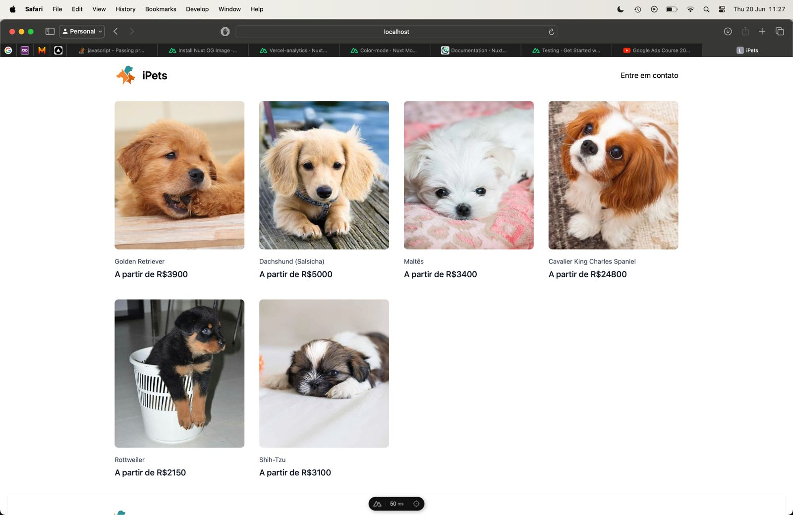

# DreamPuppy Ltda
 Todo o conteúdo de um empresa que criei. Tendo por objetivo facilitar a compra e venda de filhotes de animais de raça pura de forma honesta, segura e transparente.
 Por se tratar de um mercado sensível, toda cautela foi necessária.

## Sobre
 Como foi um projeto de duração de aproximadamente 1 ano, deu pra produzir muitas alternativas de código para testar abordagens de vendas diferentes. Sendo composto por publicações no Instagram, aplicativo mobile (Android e iOS) em Flutter, Site em NuxtJS, servidor em Python e Infra em Docker com Kubernetes.

 O objetivo do projeto seria rodar em cima do menor orçamento possível para poder se manter ativo pelo máximo de tempo, logo usei sistemas diferentes de hospedagem para tentar alcançar tal objetivo.

 - Hospedagem do Site em NuxtJS: Vercel.
 - Dominio e emails profissionais: GoDaddy.
 - Canis e cadastro de Parceiros: Firebase Firestore & Google Sheets.
 - CRM: PostgresSQL & Google Sheets.
 - Aplicativo publicado nas duas principais lojas, App Store (iOS) e Google Play (Android).
 - Hospedagem de imagens: Cloudflare Images CDN (API)
 - Hospedagem do Cluster K8s: DigitalOcean
 - O Banco de Dados (PostgresSQL) do Cluster que alimentava o App Mobile foi armazenado no Cluster até ter a necessidade de ter um Site para aproveitar os benefícios do SEO, como descrito na linha do tempo a seguir.

# Linha do Tempo
Flutter (Nov/23) -> FastAPI (Dez/23) -> Docker (Dez/23) -> Kubernetes (Jan/24) -> Lojas e Produção (Fev/24) -> NuxtJS (Abr/24)

# Tecnologias Utilizadas
### FastAPI: (1 a 2 meses)
        FastAPI é um framework Web com foco em desenvolver APIs rápidas e escaláveis. Utiliza Python como linguagem e é perfeito para uma solução rápida.
+ [x] *API*
    - O desenvolvimento da API seria rápido e direto ao ponto. Tendo necessidade apenas de alimentar o App escrito em Flutter, possibilitando a listagem e detalhamento dos filhotes disponíveis e canis parceiros responsáveis.
+ [!] *Autenticador*
    - Não cheguei a parte de adicionar uma autenticação funcional pois estava planejando essa etapa para uma próxima versão do App, em que o usuário precisaria ter cadastro para poder entrar em contato com o canil responsável pelo filhote de interesse.
    - Estive estudando formas diversas de autenticação, mas a necessidade de um Site veio antes da obrigação de cadastro. Até pelo fato de que um App ainda não validado pode gerar um pouco de desconfiança da parte dos usuários ao solicitar dados sensíveis como e-mail, senha, CPF, etc...
    - As abordagens estudadas e esboçadas foram o OAuth 2.0, Google Sign-in e Apple Sign-in.
+ [x] *PostgresSQL e Alchemy*
    - Escolhi como banco de dados principal o Postgres por ter uma familiaridade com MySQL. Na época, após algumas pesquisas, percebi que o Postgres estava em ascenção na comunidade, se tornando mais atrativo para os objetivos do projeto a longo prazo.

#### Notas:
Aprender Python não foi difícil, já que se trata de uma linguagem amplamente utilizada em ambiente acadêmico para desenvolvimento de pesquisas. Além de ser uma linguagem com foco em quem nunca teve acesso a programação antes.

Na verdade nem foi necessáriamente um aprendizado, já que utilizei em outros projetos, como Bots e automação.

Tive um pouco de dificuldade para configurar os testes unitários já que python oferece duas principais alternatívas para isso. Após escolher a que tinha a sintaxe mais elegante, dei prosseguimento para finalizar a API o mais rápido possível.
        

### Docker e Kubernetes (2 meses)
        Docker é uma alternativa a máquinas virtuais. Sendo mais prático, leve e performático, é amplamente utilizada em grandes ambientes de produção.
        Kubernetes é um orquestrador de containers, que permite que utilize o Docker de forma mais ampla e organizada, tendo a possibilidade de conectar e gerir diversas aplicações simultaneamente.
- [x] *Conteinerização da API:*
- [x] *Configuração do Cluster*
- [x] *Ambiente de desenvolvimento, stage e produção*
- [x] *Canary (Testes AB)*
- [x] Backup
- [x] Migração

#### Notas:
Provavelmente a tecnologia que mais me diverti aprendendo, já que na teoria o Docker permite uma infinidade de possibilidades, como rodar um Sistema Operacional headless de forma completamente isolada e segura.

Com um sistema avançado de redes, ele permite fazer diversas formas de conexão entre aplicações.

Me lembro de ter viciado tanto no Docker que eu rodava o container do ubuntu só pra testar comandos linux no terminal sem me preocupar em comprometer minha máquina.

### Flutter (2 semanas)
        Flutter é um framework focado em desenvolver frontend de forma amigável e performática. Utiliza a linguagem Dart, também desenvolvida pela Google.
+ [x] *Aplicativo Android*
+ [x] *Aplicativo iOS*
+ [!] *Aplicativo Web*
    - A Landing Page nunca foi a produção já que o Flutter tem um pequeno gargalo quando se trata de aplicações Web.
    - O objetivo principal do site é ser um eCommerce. Logo, foi necessário o aprendizado de uma nova tecnologia com foco em performance e SEO, o que leva a próxima etapa de aprendizado (NuxtJS).

#### Notas:
Flutter foi o que usei menos tempo em todo o projeto, já que uso no trabalho desde o lançamento da tecnologia. Sempre tive muita facilidade e afinidade com esse framework, o que permitiu que eu utilizasse mais tempo aprendendo outras ferramentas para concluir o projeto.

### NuxtJS (2 meses)
        Nuxt é um framework web full-stack com uma grande proposta em SEO e arquitetura. Utiliza como base o Vue3, que também é um framework bastante popular por ter ferramentas de SSR, que possibilita uma performance de carregamento excelente. 
+ [x] *Ecommerce*
+ [x] *Servidor e API*
+ [x] *Produção*
+ [x] *Hospedagem gratuita pela Vercel*
#### Notas:
Escolhi o Nuxt por ter uma proposta de facilidade de desenvolvimento e boas configurações para SEO, já que o Vue3 é um framework muito popular.

Como fazia tempo que não utilizava JavaScript, demorei um pouco para criar a coragem necessária para iniciar o desenvolvimento. Optei por utilizar o TypeScript já que uma linguagem tipada acelera o desenvolvimento e evita erros e bugs em produção.

Talvez não tenha feito a escolha certa, já que hoje estou trabalhando com o NextJS, que tem uma estrutura bem diferente, apesar de conseguir reaproveitar uma boa parte do que foi desenvolvido. Mas aparentemente o Next, que usa como base o React, tem uma comunidade ativa maior.

## Notas finais
Foi um projeto muito divertido e ambicioso. Apesar de ser o único desenvolvedor(provavelmente um dos motivos que impediu o sucesso da plataforma), consegui trazer várias pessoas que fizeram muita diferença e me ajudaram com a comunicação e construção da ideia.

Aprendi uma enorme quantidade de ferramentas. E mais importante: Aprendi que sou capaz de aprender qualquer coisa! Basta ter um objetivo bem definido.

Não mencionei o uso de outras ferramentas que utilizei para agilizar algumas etapas do projeto como Wix, Wordpress, etc. Já que o intuito desse repositório é deixar mais a parte de desenvolvimento, frameworks e linguagens de programação. Alguns podem ser en contrados em docs/Posts

Também fui responsável pelo desenvolvimento de todo o criativo, como postagens, descrições, escolhas de conteúdo para crescer a página e afins.

O instagram do projeto pode ser encontrado em @dreampuppy.com.br

### Agradecimentos
Agradeço ao Matheus por ter entrado como sócio no dia que o App foi publicado na apple, este me ajudou a entrar em contato com uma grande quantidade de clientes e me motivou a continuar persistindo no projeto.

Agradeço a minha namorada Lorena que me ajudou a realizar o atendimento ao cliente comprador, além de ser uma excelente crítica quanto a gestão das redes sociais.

Agradeço a minha mãe por ter incentivado e acreditado.

Agradeço a Thalles, que entrou como sócio nas ultimas semanas com o objetivo de gerir a empresa, já que este teve muita experiência no setor de StartUps.

## Screenshots
<h3>Primeira versão do App</h3>

<h3>Segunda versão do App</h3>

<h3>Site</h3>

